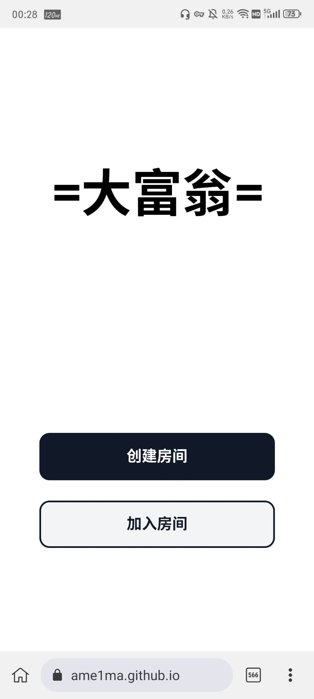
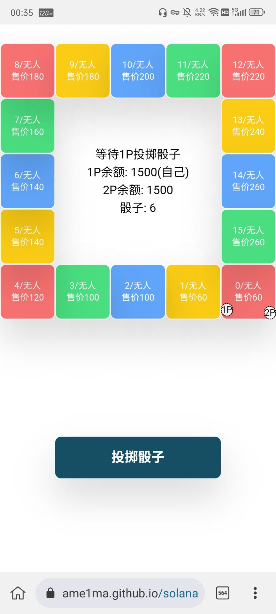
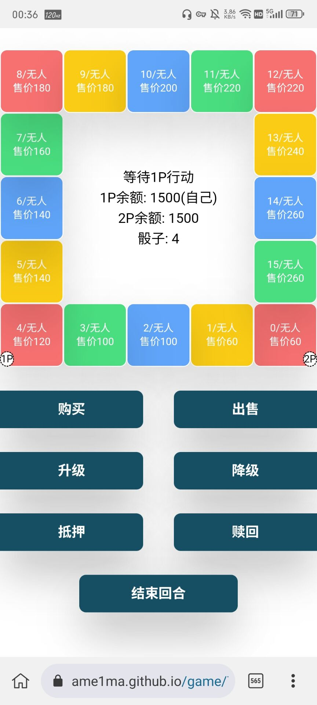
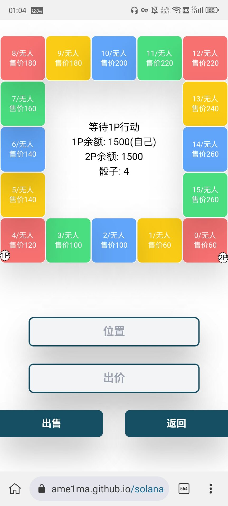
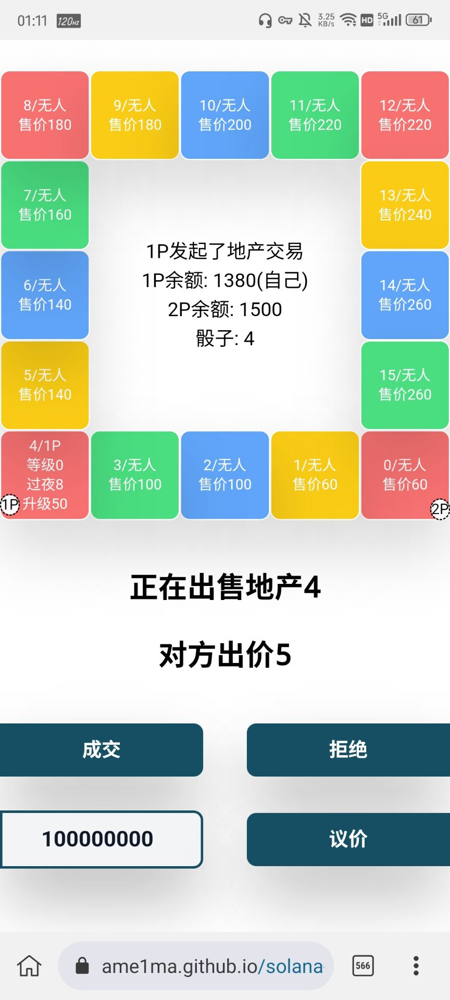
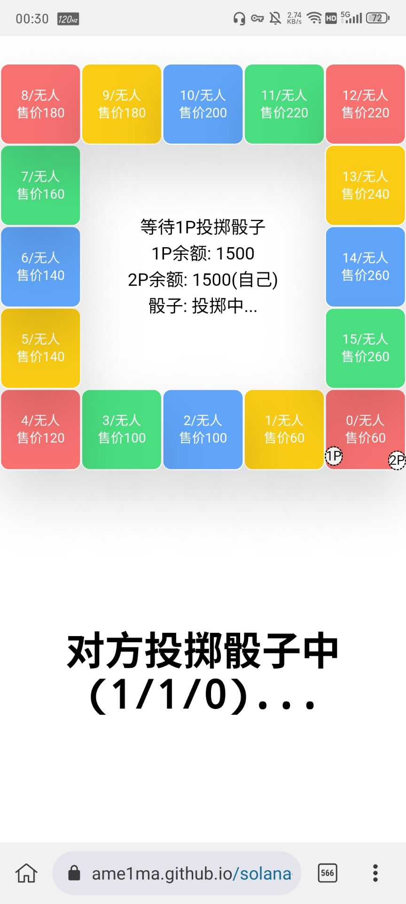
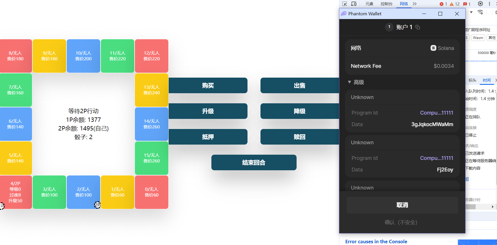

# Solana Monopoly Game


- Both frontend and program are written in Rust, the frontend uses Dioxus, and the program uses Anchor.
- Use Tailwind CSS for responsive layout, supporting both PC and mobile.
- Use Phantom, the most used Solana wallet.






**Program Address（devnet）:** ```GMDedNzaiCffFmBNVBDUzd6Ub6XLQ4xhoWfswBRmYqbG```  
**Play Online:** 
- **4everland:** https://solana-monopoly-game-frontend-deploy-1j2d63jo-ame1ma.4everland.app/
- **Github:** https://ame1ma.github.io/solana-monopoly-game-frontend-deploy/

### Play
- According to https://en.wikipedia.org/wiki/Monopoly_(game) , simplified  
- Requires browser installation [Phantom Wallet Extension](https://phantom.app/)  
- If the RPC address is not specified, the devnet is used by default，https://api.devnet.solana.com  
### Deploy
1. Install Anchor：https://www.anchor-lang.com/docs/installation  
2. Install Dioxus：https://dioxuslabs.com/learn/0.5/getting_started  
3. Install Tailwind Css：https://tailwindcss.com/docs/installation  
4. Modify the provider.wallet in `Anchor.toml`.  
5. Solana program use `anchor build` build, use `anchor deploy` deploy.
6. Frontend needs enter the frontend folder，use `dx build --release` build.

