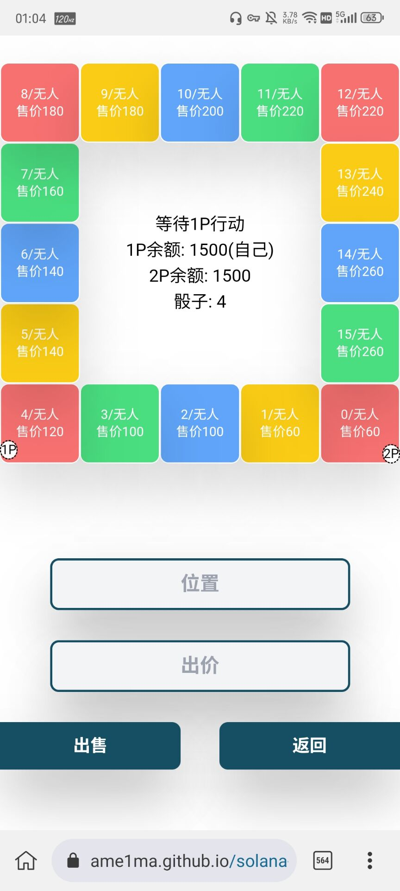
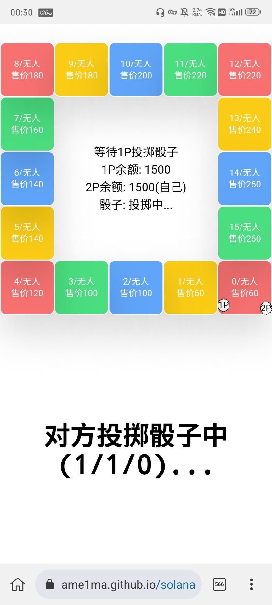
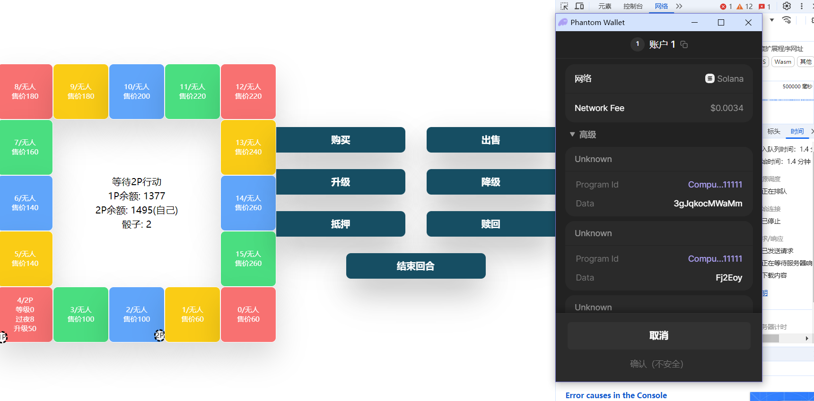

# Solana 大富翁游戏


- 前端与合约程序均采用 Rust 编写，前端使用 Dioxus 框架，合约程序使用 Anchor 框架
- 使用 Tailwind CSS 进行响应式布局，支持 PC 端与移动端页面
- 适配 Solana 生态中使用人数最多的 Phantom 钱包






**合约程序地址（devnet）:** ```GMDedNzaiCffFmBNVBDUzd6Ub6XLQ4xhoWfswBRmYqbG```  
**体验地址:** 
- **4everland:** https://solana-monopoly-game-frontend-deploy-1j2d63jo-ame1ma.4everland.app/
- **Github:** https://ame1ma.github.io/solana-monopoly-game-frontend-deploy/

### 玩法
- 依据 https://en.wikipedia.org/wiki/Monopoly_(game) ，进行了简化  
- 需要浏览器安装 [Phantom 钱包插件](https://phantom.app/)  
- RPC 地址不填写默认使用测试网，https://api.devnet.solana.com  
### 部署
1. 安装Anchor：https://www.anchor-lang.com/docs/installation  
2. 安装Dioxus：https://dioxuslabs.com/learn/0.5/getting_started  
3. 安装Tailwind Css：https://tailwindcss.com/docs/installation  
4. 修改 `Anchor.toml` 中的 provider.wallet 配置
5. 合约程序使用 `anchor build` 构建，使用 `anchor deploy` 部署
6. 前端进入 frontend 文件夹，使用 `dx build --release` 构建
